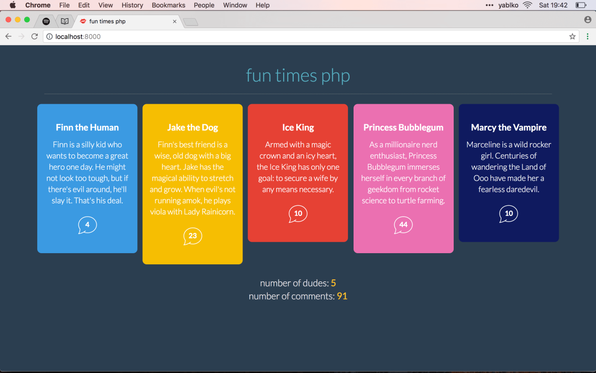

# Úloha 06 (dudes, adventures, knihy)

## a) Once More, With Feeling
Stiahni si `adventure-clean.zip`. Je to HTML kód, ktorý som vytvoril pre jeden z mojich PHP kurzov. Na tom nezáleží, to len na vysvetlenie, prečo v nadpise zbadáš text "fun times php". V kóde nájdeš:
```
const data = [ ... ]
```
je to pole objektov. _(Konkrétne ide o tzv. `JSON` formát. To isté ako objekt, len s "úvodzovkami" okolo názvov vlastností.)_

Pozri si priložený obrázok `adventure_takto_nech_to.png`.
**Toto chcem, aby si vyrobil/a**.

Rovnaký princíp, ako som pri našej žltej playdate stránke. Táto adventure stránka má trochu iné farby, trochu iný HTML kód, v objektoch budem okrem nadpisu a textu aj jedno číslo. Ale postupovať budeš rovnako.

Máš údaje, tvoja robota je napísať javascript kód, ktorých z nich vytvorí HTML elementy a vloží ich na správne miesto. V `index.html` máš ukážku hotového `article` elementu. Takéto budeš vytvárať javascriptom.

Keď si otvoríš ten `adventure-clean.zip` vidíš, že každý objekt bude povedzme `dude`. Každý `dude` má počet komentárov. Na konci vo `<footer>` elemente vypisujeme počet dudes a počet komentárov dokopy. Takže ak by si mal/a 2 dudes a prvý má 10 komentárov a druhý má 5 komentárov, chcem tam vidieť:
```
number of dudes: 2
number of comments: 15
```
**Nemusíš spraviť celú úlohu!** Sprav toľko, koľko vieš! Koľko sa ti podarí. Napríklad nemusíš spraviť tento súčet komentárov. Alebo nemusíš spraviť tie odkazy. Všimni si, že v HTML kóde mám odkaz:
```
<a href="./dude/finn-the-human">Finn the Human</a>
```
Všimni si tú adresu v `href=""` atribúte. Je to jeho meno, ale hodené na malé písmená a všetky medzery sú nahradené za `-`. Nemusíš to spraviť! Ale pokús sa to spraviť 😉 Vezmi jeho meno, hoď na lowercase, replace medzeru na pomlčku, bum bum bum!

Ten HTML kód si môžeš upraviť ako len chceš. Všetko si môžeš upraviť ako len chceš.



## b) Ďalšia takmer reálna úloha!
Vyrobíš kópiu knihobotu! V úlohe 5c si vytvoril/a pole objektov https://discord.com/channels/1147117106450681876/1367489877624623174/1367490177475416126 pre knihy. Pozri si web knihobotu, prípadne si pozri priložené obrázky. Jedno z toho je výpis všetkých produktov v cykle. Druhé z toho je výpis jedného produktu. **Vyrob 2 HTML stránky**. Jednu, ktorá zobrazí všetky knihy. Druhú, ktorá zobrazí jednu knihu. Obe budú pracovať s tými istými dátami, ale vidíš, že pri výpise všetkých kníh sú niektoré údaje ignorované. Napríklad popis knihy je iba na stránke, ktorá zobrazuje jedno konkrétnu knihu.

Od nikoho tu nečakám, že bude majster CSS vizuálneho dizajnu. Môže to byť hnusné jak (škaredá) riť. Od nikoho tu nečakám, že bude kráľ HTML kódu. Môže to byť aj výpis do konzole. Reálne chcem, aby ste si vyskúšali, že objekt v sebe môže mať ďalší objekt a ako z toho v cykle získaš hodnotu. Ak chceš vyrábať ten HTML kód, super! Ak nie, tiež OK. Ak nevieš zobraziť fotku, nevadí! **Každú úlohu si môžeš upraviť podľa seba.**

_ŠVÉDSKE STOLY DOMÁCICH ÚLOH 🇸🇪🇸🇪🇸🇪_

Všetky úlohy v sebe majú veci, ktoré som na hodine neukazoval. Programovanie nefunguje tak, že ty sa naučíš sériu príkazov a potom ich roboticky opakuješ. Programovanie je kreatívna tvorba. A neustále sa učíš nové veci. A neustále si dohľadávaš nové informácie.

Každý programátorský job, ktorý som kedy mal, som nevedel spraviť. V zmysle nefungovalo to tak, že sadnem si za počítač a presne viem, čo mám písať a napíšem to. Nie. Naopak často som nevedel ani kde začať. A začal som vyhľadávať, skúšať, písať kód ktorý vyhodím a toto som opakoval, dlhé hodiny, dokola. A na konci to bolo hotové 🙂 Takže šup!